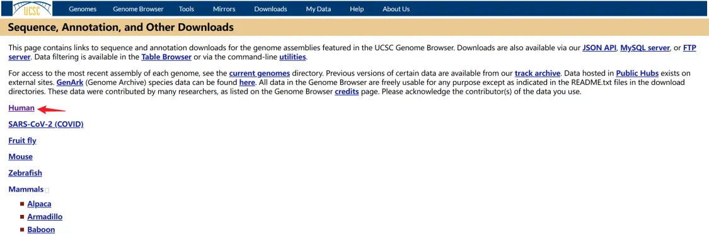
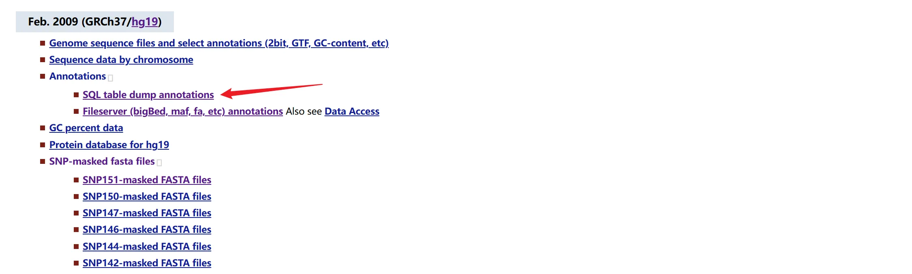
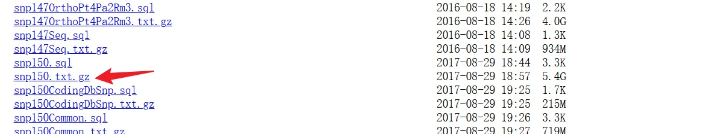
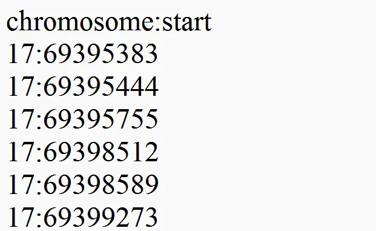
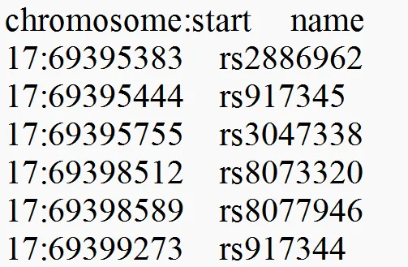

# 基于染色体号和坐标位置转换为RSID


> 整理：Yongqiang Kong
>
> 日期：2024.5.29
>
> GitHub：https://github.com/Lonelycube


[toc]

> 参考: [https://zhuanlan.zhihu.com/p/439678589](https://zhuanlan.zhihu.com/p/439678589)
> 	  [https://zhuanlan.zhihu.com/p/410164485](https://zhuanlan.zhihu.com/p/410164485)

## 1 参考数据准备

**下载 hg19 基因组版本的 dbSNP 参考数据：** snp150_hg19.txt

- 直链下载：[https://hgdownload.soe.ucsc.edu/goldenPath/hg19/database/snp150.txt.gz](https://hgdownload.soe.ucsc.edu/goldenPath/hg19/database/snp150.txt.gz)
- 上述连接如果失效，请重新进入UCSC官网搜索并下载，UCSC官网：[https://hgdownload.soe.ucsc.edu/downloads.html](https://hgdownload.soe.ucsc.edu/downloads.html)



**下滑，找到hg19版本**

**下滑，找到snp150.txt.gz, 下载即可**


**解压并改名为 snp150_hg19.txt**


## 2 使用R语言进行ID查询转换
### 2.1 整理input文件




### 2.2 使用R语言进行rsID转换
内存需求较大，建议使用服务器，R语言脚本为：
```r
# 确保以下两个R包已安装
# install.packages(dplyr)
library(dplyr)
library(data.table)

# 读取输入文件：snp_input.txt
tes = read.table("snp_input.txt",header=T,check.names=F,sep="\t") 
print("DONE：SNP_input")

# 读取参考文件：snp150_hg19.txt
match = data.table::fread("snp150_hg19.txt",header=T,check.names=F,sep="\t")
print("DONE：SNP_150_hg19")

# 基于参考文件提取rsID，并保存
# 如果snp150_hg19.txt文件中有对应的RS号，则比对到test.txt文件中，如果没有的话，就变为NA
need = dplyr::left_join(tes,match,by="chromosome:start") 
write.table(need, file ="clean.txt", sep ="\t", row.names =FALSE, col.names =TRUE, quote =FALSE) #保存文件

```

结果示例：


