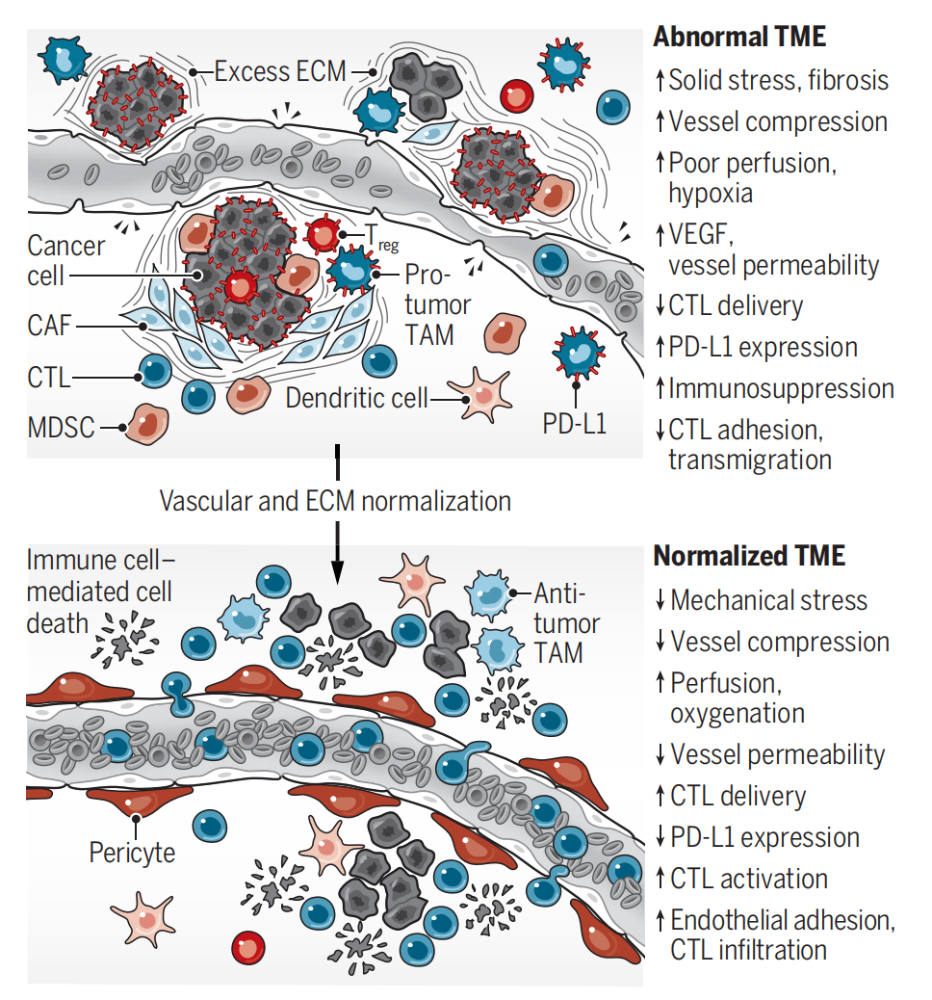

# 科研绘图配色方案

> 整理：Yongqiang Kong
>
> 日期：2024.5.25
>
> GitHub：https://github.com/Lonelycube

[toc]

## 1 底色、背景色

建议低饱和

### 文献示例：1

> Zhang Y, Wang D, Peng M, Tang L, Ouyang J, Xiong F, Guo C, Tang Y, Zhou Y, Liao Q, Wu X, Wang H, Yu J, Li Y, Li X, Li G, Zeng Z, Tan Y, Xiong W. Single-cell RNA sequencing in cancer research. ***J Exp Clin Cancer Res***. 2021 Mar 1;40(1):81. doi: 10.1186/s13046-021-01874-1. PMID: 33648534; PMCID: PMC7919320.

&emsp;&emsp;&emsp;	#f4f4f3

&emsp;&emsp;&emsp;	#fcf4ee

### 文献示例：2

> Zhang Y, Wang D, Peng M, Tang L, Ouyang J, Xiong F, Guo C, Tang Y, Zhou Y, Liao Q, Wu X, Wang H, Yu J, Li Y, Li X, Li G, Zeng Z, Tan Y, Xiong W. Single-cell RNA sequencing in cancer research. ***J Exp Clin Cancer Res***. 2021 Mar 1;40(1):81. doi: 10.1186/s13046-021-01874-1. PMID: 33648534; PMCID: PMC7919320.

&emsp;&emsp;&emsp;	#6098cc

&emsp;&emsp;&emsp;	#c55b10

&emsp;&emsp;&emsp;	#92cf52

&emsp;&emsp;&emsp;	#dfe9f3

### 文献示例：3

> Munn LL, Jain RK. Vascular regulation of antitumor immunity. ***Science***. 2019 Aug 9;365(6453):544-545. doi: 10.1126/science.aaw7875. PMID: 31395771; PMCID: PMC7321824.

&emsp;&emsp;&emsp;	#b03d26

&emsp;&emsp;&emsp;	#005f81

&emsp;&emsp;&emsp;	#9ccfe6

&emsp;&emsp;&emsp;	#e0897e

&emsp;&emsp;&emsp;	#a5a7ab

### 文献示例：4

> Yazar S, Alquicira-Hernandez J, Wing K, Senabouth A, Gordon MG, Andersen S, Lu Q, Rowson A, Taylor TRP, Clarke L, Maccora K, Chen C, Cook AL, Ye CJ, Fairfax KA, Hewitt AW, Powell JE. Single-cell eQTL mapping identifies cell type-specific genetic control of autoimmune disease. ***Science***. 2022 Apr 8;376(6589):eabf3041. doi: 10.1126/science.abf3041. Epub 2022 Apr 8. PMID: 35389779.

&emsp;&emsp;&emsp;	#db1e25

&emsp;&emsp;&emsp;	#e76024

&emsp;&emsp;&emsp;	#f29329

&emsp;&emsp;&emsp;	#f5c03f

&emsp;&emsp;&emsp;	#f5ed57

&emsp;&emsp;&emsp;	#cadfab

&emsp;&emsp;&emsp;	#90c987

&emsp;&emsp;&emsp;	#4db264

&emsp;&emsp;&emsp;	#7bb0df

&emsp;&emsp;&emsp;	#5089c8

&emsp;&emsp;&emsp;	#d5c1de

&emsp;&emsp;&emsp;	#b278a6

&emsp;&emsp;&emsp;	#892d72

​    
